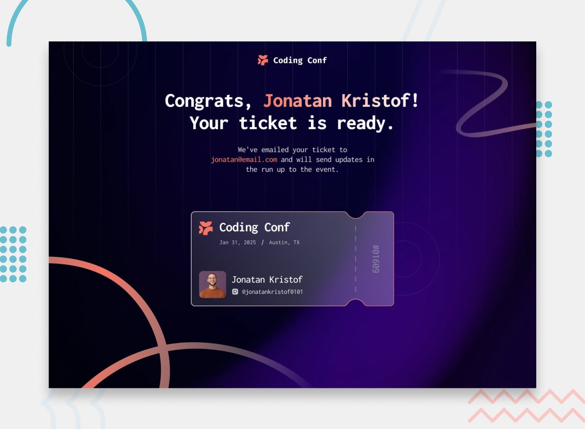

# Frontend Mentor - Conference ticket generator



## Project Structure 
```text
│
├── index.html               # Entry HTML file
├── style.css                # Global styles 
│
├── src/                     # All application source code
│   │
│   ├── main.js              # App entry point (initializes controllers)
│   │
│   ├── models/              # Models = data layer
│   │   └── FileModel.js
│   │
│   ├── services/            # Services = business logic (reusable)
│   │   ├── ValidationService.js
│   │   └── UIService.js
│   │
│   ├── controllers/         # Controllers = glue between view & model
│   │   └── FileController.js
│   │
│   ├── utils/               # Small helpers, generic utilities and DOM helpers
│   │   └── DOMutils.js
│   │
│   ├── views/               # (Optional) If you later split UI components
│   │   └── uploadView.html  # uploaded DOM 
│   │
│   └── assets/              # Images, icons, fonts, etc.
│       ├── images/
│       │   └── icon-upload.svg
│       └── fonts/
│
│
├── tests/                   # All your tests live here
│   ├── models/
│   │   └── FileModel.test.js
│   ├── controllers/
│   │   └── FileController.test.js
│   ├── services/
│   │   └── ValidationService.test.js
│   └── utils/
│       └── DOMutils.test.js
│
└── package.json             # (if you later use npm/yarn)


```

